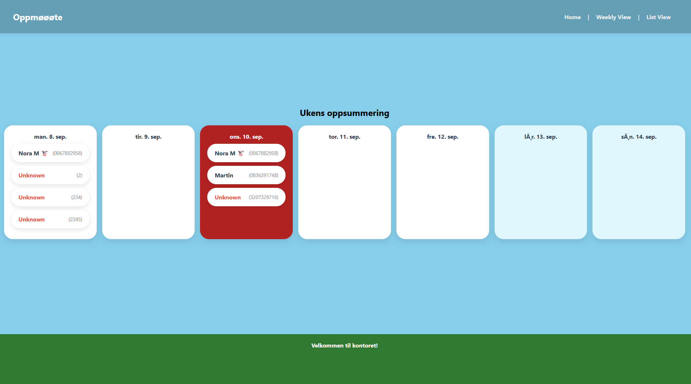

#### Dashboard for nysgjerrigperer og masterstudenter med konkurranseinstinkt og/eller motivasjonsvansker

Bruker Python, Flask, med en SQL database.

Kjør fila app.py

Gå til typ http://localhost:5000/ 

app.py starter en meny i terminalen, der du enten kan ha vanlig modus der den lytterr etter RFID-scan (alternativt bare skriv inn din ID + ENTER), eller legge til en ny bruker

Nettsida oppdateres med et par sekunders intervall.

attendance.db er databasen for alle scanna oppmøter og registrerte brukere

users.csv er en tabell der man kan legge til bruker, de blir så lagt til i selve databasen når app.py startes. strengt tatt ikke nødvendig, men blir litt idiotsikring mens man kødder rundt med databasen da